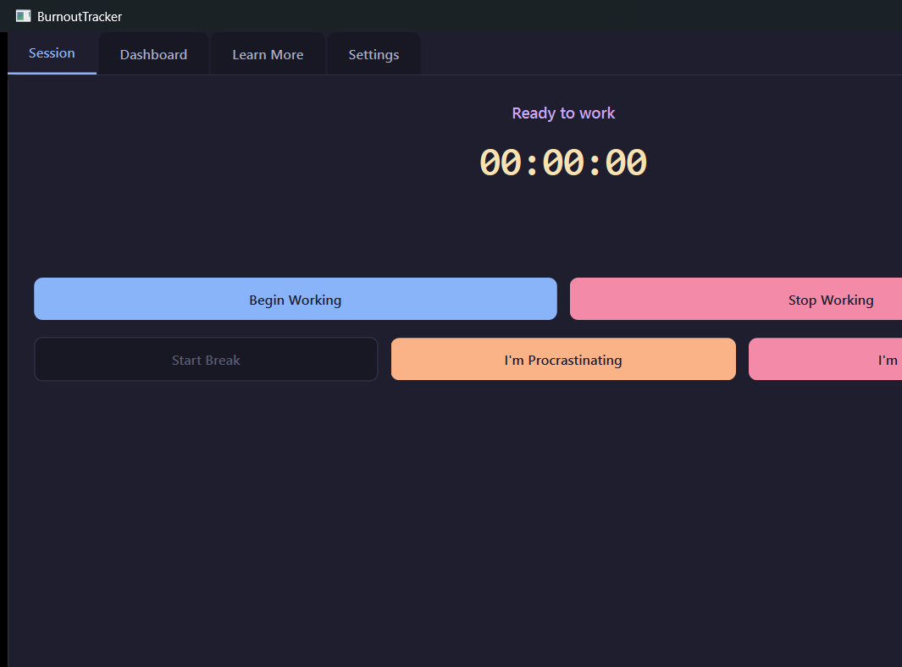
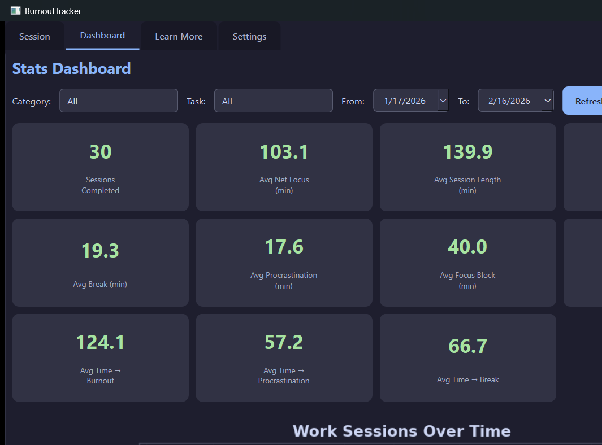

# BurnoutTracker - AI Animated Desktop Buddy

A local desktop application that tracks work sessions, predicts burnout before it happens, and keeps you company with an animated pixel-art mushroom buddy that lives on your screen.
I built this after struggling to stay focused without burning out - it's a local ML tracker that learns your personal focus patterns and tells you when to stop before it's too late. Python, PySide6, scikit-learn.
All data stays on your machine - no cloud, no accounts, no telemetry.


---

## Quick Start

### 1. Install dependencies
```bash
pip install -r requirements.txt
```

### 2. (Optional) Seed fake data for testing
```bash
python scripts/seed_data.py
```

### 3. Run the app
```bash
python main.py
```

### 4. Run tests
```bash
pytest tests/ -v
```

---

## Features

### Session Tracking
Start a session by clicking the mushroom buddy on your desktop. You pick a **category** (e.g. "Work", "Study", "Personal") and an optional **task name**. The app records start time, end time, how long you were focused vs. on break, and whether burnout or procrastination was detected.

Sessions are stored in a local SQLite database and build up a personal history over time that the ML layer learns from.

**Implementation:** `src/services/session_service.py` - a state machine with four states: `idle → working ↔ on_break / procrastinating → idle`. Events (start, break, resume, end) are written to a normalized SQLite schema via a Repository pattern (`src/data/repository.py`). All SQL is centralized there - no queries scattered across the codebase.

---

### Burnout & Procrastination Detection
Two modes work together:

- **Manual check-in** - the buddy periodically pops up and asks "Are you burnt out?" or "Are you procrastinating?" You answer yes/no. Answers are logged.
- **ML-predicted proactive check** - after enough sessions have accumulated, the ML engine predicts *when* you're likely to hit burnout and triggers the check early, before you feel it.

Procrastination gets a separate 5-minute nag reminder: if you told it you're procrastinating but haven't started working again, the buddy bounces to remind you.

**Implementation:** `src/services/tracking_service.py` - runs three `QTimer`s on the Qt event loop: a burnout check timer (default 45 min), a procrastination reminder timer (default 5 min), and a break-elapsed timer (default 30 min). All intervals are overridable by the ML prediction or manually in settings.

---

### ML Prediction Engine
Six models train on your personal session history and get more accurate as you use the app:

| Model | Predicts |
|---|---|
| `time_to_burnout` | Minutes until you'll likely burn out |
| `time_to_procrastination` | Minutes until procrastination risk peaks |
| `time_to_break` | When to suggest a break |
| `net_focused_time` | Total focused time you'll get from a session |
| `time_to_first_interruption` | How long before the first distraction |
| `focus_block_length` | How long your focused blocks tend to run |

The models degrade gracefully when data is sparse:
1. **≥ 8 sessions in your category** → linear regression (scikit-learn)
2. **≥ 3 sessions in your category** → exponential moving average
3. **≥ 3 sessions globally** → global moving average
4. **< 3 sessions** → returns `None`, manual intervals used instead

**Implementation:** `src/ml/predictor.py` - uses `sklearn.linear_model.Ridge` per target. Features include session start hour, day of week, category ID, and recent averages. Models are pickled to `models/` and retrained on launch or after every N sessions. No heavy frameworks - just NumPy and scikit-learn.

---

### Break Suggestions (Research-Backed)
When the app suggests a break, it doesn't just say "take a break" - it shows you what the research says about *why* and *how long*. The built-in knowledge base includes:

- **Pomodoro Technique** - 25 min work / 5 min break (Cirillo, 2006)
- **DeskTime 52/17 Rule** - 52 min work / 17 min break
- **Ultradian Rhythm** - 90-minute focus cycles aligned with natural brain rhythms
- **Microsoft Research** - findings on context-switching cost and recovery time

**Implementation:** `src/services/break_research.py` - a static dataclass-based knowledge base. The UI surfaces these as formatted cards with citation links. No external API calls.

---

### Dark Mode Dashboard
A statistics panel showing your productivity patterns across sessions. Includes:

- **6 chart types**: session duration over time, focus vs. break ratio, burnout frequency heatmap, category breakdown, task completion rates, and ML prediction accuracy
- **Flexible date filters**: today, this week, this month, custom range
- **Metric cards**: total sessions, total focused time, average session length, burnout rate

**Implementation:** `src/ui/dashboard_widget.py` - uses PySide6's `QtCharts` for native interactive charts with hover tooltips. Chart generation is abstracted behind `src/ui/plot_backend.py`, which was designed to be swappable with MATLAB (see `docs/MATLAB_SWAP_GUIDE.md`). Styling follows a Notion-inspired dark mode palette.

---

### Animated Desktop Buddy
A transparent always-on-top window that renders a pixel-art mushroom character directly on your desktop. The buddy:

- Sits in a corner and bobs gently while you work
- Has a **speech bubble menu** when clicked - all main app actions are accessible from it
- Plays **8 distinct animations**: idle bob, blink, happy bounce, walk-wobble, jump arc (with squash-on-landing), angry shake with steam puffs, and two attack variants
- Reacts to events: jumps to get your attention for reminders, goes angry for overdue procrastination nags

Pixel-art sprites are **procedurally generated in Python at runtime** - no image files shipped. The generator draws each frame pixel-by-pixel using `QPainter`, with a full color palette, outline pass, highlights, and shadows.

**Implementation:**
- `src/animation/sprite_generator.py` - draws the mushroom frame-by-frame using `QImage` + `QPainter`. The cap is rendered row-by-row using a profile table to approximate a dome shape. Each animation state (idle, blink, jump, etc.) is its own frame generator function. Sprites are cached to `src/assets/sprites/` after first generation.
- `src/animation/sprite_engine.py` - finite state machine managing which animation plays. Supports looping states and one-shot states (play once, return to idle). One-shot states can chain via callbacks, e.g. `angry_emote → attack_1 → attack_2`. All timing is configurable in `config/animation.json`.
- `src/animation/buddy_widget.py` - a frameless, transparent `QWidget` with `WindowStaysOnTopHint`. Renders the current sprite frame each tick and handles mouse events for dragging and the speech bubble menu.

---

### Sound Effects
Soft chime sounds play on buddy interactions. All audio is **procedurally generated** using NumPy sine waves - no audio files included.

**Implementation:** `src/animation/sound_manager.py` - generates waveforms at runtime using NumPy and plays them via pygame's mixer. Different tones for different events (notification, click, angry, etc.).

---

### System Tray Integration
The main window can be closed to the system tray. The buddy stays on screen regardless. Right-clicking the tray icon gives quick access to open the dashboard or quit.

---

### Data Export
Export your full session history to CSV from the settings panel for use in Excel, Notion, or any other tool.

---

### Configurable Settings
- Burnout check interval (minutes)
- Procrastination reminder interval (minutes)
- Break elapsed reminder interval (minutes)
- Sprite scale (0.5× to 5×)
- Animation toggles (blink, idle variants, jump notify, aggressive animation)
- Sound toggle and volume
- Master animation on/off

All settings are persisted to `config/animation.json`.

---

## Project Structure

```
BurnoutTracker/
├── main.py                  # Entry point
├── requirements.txt         # Python dependencies
├── burnout_tracker.db       # SQLite database (auto-created)
├── INTERVIEW_NOTES.md       # Detailed system explanation
│
├── src/
│   ├── data/                # Data layer
│   │   ├── database.py      #   SQLite connection & schema
│   │   ├── models.py        #   Dataclass models (Session, Task, Category, Event)
│   │   └── repository.py    #   All SQL queries (Repository pattern)
│   │
│   ├── services/            # Business logic
│   │   ├── session_service.py    # Session state machine
│   │   ├── tracking_service.py   # Proactive reminder timers
│   │   └── break_research.py     # Productivity research knowledge base
│   │
│   ├── ml/                  # Machine learning
│   │   └── predictor.py     #   6 regression models with graceful fallback
│   │
│   ├── animation/           # Desktop buddy system
│   │   ├── sprite_engine.py     # Animation state machine (8 states)
│   │   ├── sprite_generator.py  # Procedural pixel-art generation
│   │   ├── buddy_widget.py      # Transparent overlay widget
│   │   └── sound_manager.py     # Procedural SFX generation & playback
│   │
│   ├── ui/                  # User interface
│   │   ├── main_window.py       # Central window & session controls
│   │   ├── dashboard_widget.py  # Stats dashboard with 6 chart types
│   │   ├── settings_widget.py   # Settings panel
│   │   ├── plot_backend.py      # Chart generation (MATLAB-swappable)
│   │   └── styles.py            # Dark theme stylesheet
│   │
│   └── assets/              # Generated assets (sprites, sounds - gitignored)
│
├── config/
│   └── animation.json       # Animation & sound configuration
│
├── tests/
│   ├── test_data.py         # Repository & model tests
│   ├── test_services.py     # Session service & tracking tests
│   └── test_ml.py           # Predictor tests
│
├── scripts/
│   └── seed_data.py         # Generates realistic fake session history
│
└── docs/
    └── MATLAB_SWAP_GUIDE.md # How to swap matplotlib → MATLAB for charts
```

---

## Tech Stack

| Library | Role |
|---|---|
| **Python 3.10+** | Language |
| **PySide6** | Native Qt UI, charts, transparent overlay |
| **SQLite** | Local persistent storage (via `sqlite3` stdlib) |
| **scikit-learn** | Ridge regression for ML predictions |
| **NumPy** | Feature engineering, moving averages, audio waveforms |
| **matplotlib** | Secondary chart backend (swappable with MATLAB) |
| **pygame** | Audio playback for procedural sound effects |

---

## Screenshots

| Main window | Dashboard | Settings |
|---|---|---|
|  |  |  |
